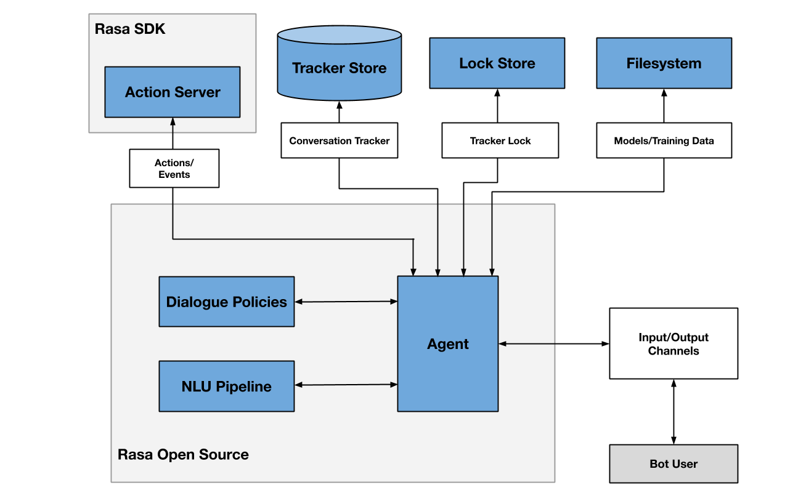

# Rasa 架构概述

Rasa 具有可扩展的架构。阅读有关 Rasa 的关键组件信息。

下图概述了 Rasa 架构。两个主要组件是自然语言理解（NLU）和对话管理。

NLU 是处理意图分类、实体提取和响应检索的部分。它在下面显示为 NLU Pipeline，因为它使用经过训练的流水线生成的 NLU 模型处理用户消息。

对话管理组件根据上下文确定对话的下一个动作。在图中显示为 Dialogue Policies。

<figure markdown>
  
  <figcaption>Rasa 架构</figcaption>
</figure>
