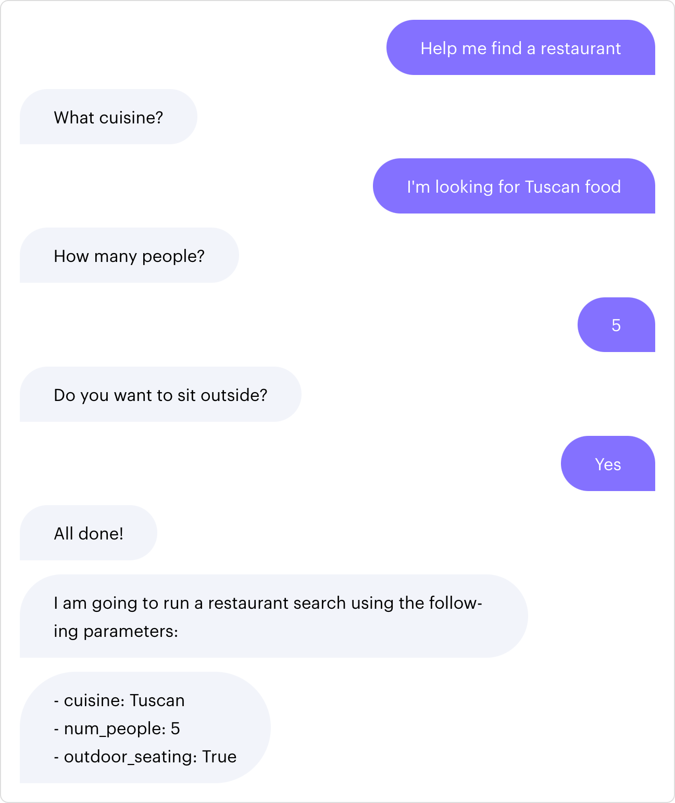

# 处理业务逻辑

对话机器人通常需要向用户询问信息来帮助他们。你可以使用表单来收集所需的用户信息并完成请求。

对话机器人通常在支持用户目标时需要在做某些事之前从用户那里收集所需的信息。例如：一个餐厅搜索对话机器人需要收集一些有关用户偏好的信息，以便找到合适的餐厅：

<figure markdown>
  { width="600" }
  <figcaption>寻找一个餐厅</figcaption>
</figure>

本页面是处理收集用户信息以完成请求的业务逻辑的指南。在上面的示例中，业务逻辑包含了解用户喜欢的菜系、聚会人数和座位偏好。本页面的示例来自于 [formbot 示例对话机器人](https://github.com/RasaHQ/rasa/tree/main/examples/formbot)。

## 使用表单处理业务逻辑指南 {#step-by-step-guide-on-using-forms-to-handle-business-logic}

[表单](forms.md)通过提示用户输入信息来完成工作，直至收集所有必须的信息。信息存储在[槽](domain.md#slots)中。一旦所有必须的槽都被填满，对话机器人就会处理用户的原始请求。

### 定义表单 {#defining-the-form}

要定义一个表单，你需要定义：

- 槽映射：要收集的所需信息
- 响应器：对话机器人应如何询问每条信息

#### 槽映射 {#slot-mappings}

对于餐厅搜索示例，我们希望从用户那里收集如下信息：

- 菜系
- 人数
- 是否想坐在外面

你可以通过在表单名称下指定所需槽的列表在领域中定义一个表单：

```yaml title='domain.yml'
forms:
  restaurant_form:
    required_slots:
        - cuisine
        - num_people
        - outdoor_seating
```

这些槽需要添加到领域的 `slots` 部分，以及定义如何填充槽的[槽映射](domain.md#slot-mappings)。对于从 `from_entity` 填充的槽，还需要将实体添加到领域中。由表单填充的槽通常不会影响对话，因此需要将 `influence_conversation` 设置为 `false`：

```yaml title='domain.yml'
entities:
  - cuisine
  - number
slots:
  cuisine:
    type: text
    mappings:
    - type: from_entity
      entity: cuisine
  num_people:
    type: float
    mappings:
    - type: from_entity
      entity: number
  outdoor_seating:
    type: bool
    mappings:
    - type: from_intent
      intent: affirm
      value: true
      conditions:
       - active_loop: restaurant_form
         requested_slot: outdoor_seating
    - type: from_intent
      intent: deny
      value: false
      conditions:
      - active_loop: restaurant_form
        requested_slot: outdoor_seating
```

`number` 槽通过实体进行填充。[DucklingEntityExtractor](components.md#ducklingentityextractor) 可以提取像数字这样的实体。要使用它，请将 DucklingEntityExtractor 添加到 NLU 流水线中：

```yaml title='config.yml'
language: en
pipeline:
# other components
- name: DucklingEntityExtractor
  dimensions: ["number"]
```

#### 带条件的槽映射 {#slot-mappings-with-conditions}

`outdoor_seating` 槽会基于用户的意图进行填充，如果是 `affirm` 则为 `true`，如果是 `deny` 则为 `false`。

但是，只有在用户回答问题“Do you want to sit outside?”时，才应该将槽设置为 `true` 或 `false`。要强制此条件，`outdoor_seating` 槽的条件要求 `restaurant_form` 处于活动状态，并且请求的槽为 `outdoor_seating`。如果没有条件并且用户在对话的早些时候发送了一条带有 `affirm` 或 `deny` 意图的消息，那么当激活表单时，`outdoor_seating` 槽就已经被填充了。因此，该表格不会提示用户对于座位的偏好。更多信息请参见[条件映射](domain.md#mapping-conditions)。

#### 验证槽 {#validating-slots}

通常，你需要在接受用户输入之前对其进行验证，例如检查给定的菜系是否在对话机器人的可用菜系数据库中。有关验证动作的更多信息，请参阅[验证表单输入](forms.md#validating-form-input)的文档。

#### 请求槽 {#requesting-slots}

要指定机器人如何询问所需的信息，你可以在领域中定义名为 `utter_ask_{slotname}` 的 [`responses`](domain.md#responses)：

```yaml title='domain.yml'
responses:
  utter_ask_cuisine:
    - text: "What cuisine?"
  utter_ask_num_people:
    - text: "How many people?"
  utter_ask_outdoor_seating:
    - text: "Do you want to sit outside?"
```

### 更新配置 {#updating-the-configuration}

一个表单的[期望路径](glossary.md#happy--unhappy-paths)应该定义为[规则](rules.md)，这意味着你需要将 [RulePolicy](policies.md#rule-policy) 添加到策略中：

```yaml title='config.yml'
policies:
  - name: RulePolicy
```

### 创建规则 {#creating-rules}

表单本身负责向用户询问所有必要信息的逻辑，因此你只需要两条规则来实现表单的期望路径：一条定义何时开始，另一条定义填写完成后会发生什么。对于餐厅搜索示例，在现实生活中，对话机器人会根据用户的偏好查找餐厅。在这种情况下，对话机器人会将响应用于搜索的详细信息。

```yaml title='rules.yml'
rules:
  - rule: activate restaurant form
    steps:
      - intent: request_restaurant   # intent that triggers form activation
      - action: restaurant_form      # run the form
      - active_loop: restaurant_form # this form is active

  - rule: submit form
    condition:
    - active_loop: restaurant_form   # this form must be active
    steps:
      - action: restaurant_form      # run the form
      - active_loop: null            # the form is no longer active because it has been filled
      - action: utter_submit         # action to take after the form is complete
      - action: utter_slots_values   # action to take after the form is complete
```

通过拆分表单的激活和提交，如果用户提供[非预期的输入](unexpected-input.md)或通过[闲聊](chitchat-faqs.md)打断了表单，规则仍然可用。

### 更新 NLU 训练数据 {#updating-the-nlu-training-data}

你需要为应该激活表单的意图添加样本，以及用户将如何提供所需信息的样本。

#### 表单激活意图 {#form-activation-intents}

你需要为应该激活表单的意图添加训练样本。为 `request_restaurant` 意图添加样本：

```yaml title='nlu.yml'
nlu:
- intent: request_restaurant
  examples: |
    - im looking for a restaurant
    - can i get [swedish](cuisine) food in any area
    - a restaurant that serves [caribbean](cuisine) food
    - id like a restaurant
    - im looking for a restaurant that serves [mediterranean](cuisine) food
    - can i find a restaurant that serves [chinese](cuisine)
```

默认情况下，由 `from_entity` 填充的槽可以被任意用户话语填充，无论其意图如何，只要提取了正确的实体即可。这意味着如果用户在他们的第一条消息中提供 `cuisine` 实体，则在表单在开始时槽即被填充，同时对话机器人将不会再向用户询问菜系。

#### 表单填写意图 {#form-filling-intents}

在表单填充槽时，它并不会在意预测为哪个意图，除非槽映射明确要求或排除某一个意图。

对于餐厅搜索示例，`outdoor_seating` 槽映射到两个意图，因此你需要为这些意图添加训练数据。

对于 `cuisine` 和 `number` 槽，由于没有指定意图，因此你可以将样本添加至通用通知意图中去。你需要标注 `cuisine` 实体以便 DIETClassifier 可以学习并提取它。你不需要标注 `number` 实体，由于 DucklingEntityExtractor 是一个基于规则的提取器，并不需要根据你的训练数据进行训练。每个意图仅显示了几个示例，为了让你的对话机器人正常工作，你应该添加比如下显示更多的训练数据：

```yaml title='nlu.yml'
nlu:
- intent: affirm
  examples: |
    - Yes
    - yes, please
    - yup
- intent: deny
  examples: |
    - no don't
    - no
    - no I don't want that

- intent: inform
  examples: |
    - [afghan](cuisine) food
    - how bout [asian oriental](cuisine)
    - what about [indian](cuisine) food
    - uh how about [turkish](cuisine) type of food
    - um [english](cuisine)
    - im looking for [tuscan](cuisine) food
    - id like [moroccan](cuisine) food
    - for ten people
    - 2 people
    - for three people
    - just one person
    - book for seven people
    - 2 please
    - nine people
```

更新领域来包含这些意图：

```yaml title='domain.yml'
intents:
  - request_restaurant
  - affirm
  - deny
  - inform
```

### 定义响应 {#defining-the-responses}

添加用于提交表单之后发送的响应：

```yaml title='domain.yml'
responses:
  utter_submit:
  - text: "All done!"
  utter_slots_values:
  - text: "I am going to run a restaurant search using the following parameters:\n
            - cuisine: {cuisine}\n
            - num_people: {num_people}\n
            - outdoor_seating: {outdoor_seating}"
```

## 总结 {#summary}

表单可以简化收集用户信息的逻辑。要定义像上面的餐厅搜索示例这样的最小示例表单，你需要做到如下：

- 将 RulePolicy 添加至 `config.yml`
- 在领域中定义具有所需槽的表单
- 在领域中为所需的槽添加槽映射
- 添加用于激活和提交表单的规则
- 为用于激活表单的意图添加样本
- 为填充所需槽的意图添加样本
- 定义表单完成时对话机器人要采取的动作或响应
- 使用定义的新意图和动作更新领域

要尝试新定义的表单，需要通过运行 `rasa train` 重新训练对话机器人模型并启动 `rasa shell`。由于 DucklingEntityExtractor 将用于提取实体，你需要在后台启动 Duckling（请参见[运行 Duckling 说明](components.md#DucklingEntityExtractor)）。
