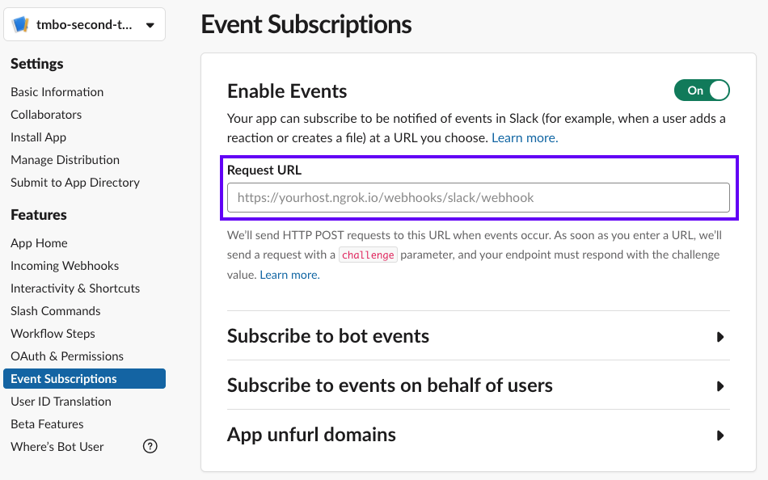
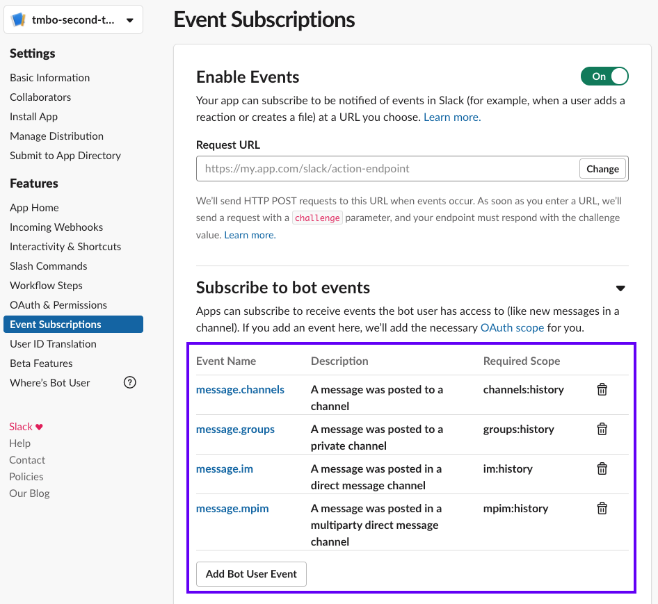

# Slack

将对话机器人连接到 Slack 需要将其配置为发送消息（使用 API 凭据）和接收消息（使用 webhook）。

## 发送消息 {#sending-messages}

在你的 Rasa 项目的根文件夹中创建一个新文件 `credentials.yml`（如果使用过 `rasa init`，该文件应该已经存在，可以对其进行编辑）。将如下内容添加到文件中：

```yaml title="credentials.yml"
slack:
  slack_channel: "CA003L0XZ"    # channel ID, not a channel name!
  slack_token: "xoxb-XXX"       # token obtained in the next step
  slack_signing_secret: "YYY"   # secret obtained in the next step
```

除了侦听直接消息和应用提及的默认行为（例如 `@app_name`）之外，`slack_channel` 可以作为对话机器人通信侦听的一个频道或个人。要获取频道 ID，请右键单击 Slack 中的 `channel` 并选择 `Copy Link`。ID 是 URL 中的最后一部分。

在接下来的几个步骤中，你将创建一个 Slack 应用来获取 `slack_token` 和 `slack_signing_secret` 的值：

1. 要创建应用，请转到 [Your Apps](https://api.slack.com/apps)并单击 `Create New App`。

    <figure markdown>
      
      <figcaption>创建应用</figcaption>
    </figure>

    填写 `App Name` 并选择 `Development Workspace`，你将在其中构建你的应用。

2. 前往 `OAuth & Permissions` 并向下滚动到 `Scopes`。`Scopes` 将为应用提供在工作区中执行操作的权限。

    要开始，至少应该添加如下内容：

      - `app_mentions:read`
      - `channels:history`
      - `chat:write`
      - `groups:history`
      - `im:history`
      - `mpim:history`
      - `reactions:write`

    <figure markdown>
      
      <figcaption>设置 Slack 权限</figcaption>
    </figure>

    在 Slack API 文档中，你可以找到[所有可用 scope 的列表和说明](https://api.slack.com/scopes)。

3. 在 `OAuth & Permissions` 页面上，单击 `Install App to Workspace` 来将机器人添加到你的工作区。

    <figure markdown>
      
      <figcaption>安装应用</figcaption>
    </figure>

    添加后，Slack 将向你显示一个 `Bot User OAuth Access Token`，你需要将其添加到 `credentials.yml` 中作为 `slack_token` 的值：

    ```yaml title="credentials.yml" hl_lines="3"
    slack:
      slack_channel: "your-channel" # choose a channel for your bot
      slack_token: "xoxb-XXX"       # token obtained in the next step
      slack_signing_secret: "YYY"   # secret obtained in the next step
    ```

    令牌应该以 `xoxb` 开头。

4. 前往 `Basic Information` 来获取 `Signing Secret`。

    <figure markdown>
      
      <figcaption>Signing Secret</figcaption>
    </figure>

    将 `signing secret` 复制到 `credentials.yml` 中作为 `slack_signing_secret` 的值：

    ```yaml title="credentials.yml" hl_lines="4"
    slack:
      slack_channel: "your-channel" # choose a channel for your bot
      slack_token: "xoxb-XXX"       # token obtained in the next step
      slack_signing_secret: "YYY"   # secret obtained in the next step
    ```

此设置将允许你的机器人发送消息。现在让我们转到接受和响应消息的设置。

## 接受消息 {#receiving-messages}

在继续之前，请确保你已配置用于[发送消息](#sending-messages)的 Slack 应用并将 Slack 凭据添加到 `credentials.yml` 文件中。

要接收消息，你需要一个公开的 URL，以便 Slack 访问你的对话机器人并告诉你最新的消息。如果在本地运行，可以使用 [ngrok 测试频道](../messaging-and-voice-channels.md#testing-channels-on-your-local-machine)。

1. 要配置对话机器人接收消息，你的机器人需要首先运行。使用如下命令启动对话机器人：

    ```shell
    rasa run
    ```

    如果在本地运行，请确保 ngrok（或其他公共 URL 工具）也处于运行状态。

2. 要使用 Slack UI 直接向你的对话机器人发送消息，请前往 `App Home`，滚动到底部并选中 `Allow users to send Slash commands and messages from the messages tab`。

    你可能必须退出 Slack 应用并重新打开它，然后更改才会生效。

3. 前往 `Event Subscriptions` 并打开 `Enable Events` 来配置 webhook。

    作为请求 URL，输入对话机器人的公开 URL 并添加 `/webhooks/slack/webhook`，例如：`https://<host>/webhooks/slack/webhook`，将 `<host>` 替换为你的 URL。如果你使用的是 ngrok，你的 URL 应该类似于 `https://92832de0.ngrok.io/webhooks/slack/webhook`。

    你无法使用 `localhost` 网址。

    <figure markdown>
      
      <figcaption>请求 URL</figcaption>
    </figure>

4. 作为最后一步，你需要在同一页面上订阅对话机器人事件。你需要添加如下事件：

    - `message.channels`
    - `message.groups`
    - `message.im`
    - `message.mpim`

    <figure markdown>
      
      <figcaption>订阅对话机器人事件</figcaption>
    </figure>

    添加这些事件后，请务必点击页面底部的 `Save Changes`。

    如果你在设置发送消息时没有为你的应用授予所有必须的权限，系统会提示你重新安装需要执行的应用。否则，Slack 将通过确认你的更改。

!!! info "频道邀请"

    根据 [Slack 文档](https://api.slack.com/authentication/basics#calling)，请确保邀请你的对话机器人到其应该访问的问道。你可以通过在频道中使用 `/invite` 来邀请。

现在你的对话机器人已准备就绪，并将接收新消息的 webhook 通知。

## 可选：交互式组件 {#optional-interactive-components}

完成[发送消息](#sending-messages)和[接收消息](#receiving-messages)后，对话机器人就可以开始使用了。如果你想使用 Slack 的[交互组件](https://api.slack.com/block-kit/interactivity)（按钮或菜单），你需要做一些额外的配置：

打开 `Interactivity & Shortcuts` 页面并将 `Interactivity` 切换为打开。之后，你需要在[接收消息](#receiving-messages)的第二步中使用的 `Request URL` 字段中输入相同的 URL，例如：`https://<host>/webhooks/slack/webhook`。
    <figure markdown>
      
      <figcaption>开启交互</figcaption>
    </figure>

## 额外 Slack 选项 {#additional-slack-options}

如下是 Slack 连接的所有配置参数的完整概述：

```yaml title="credentials.yml"
slack:
  slack_channel: "CA003L0XZ"    # channel ID, not a channel name!
  slack_token: "xoxb-XXX"       # token obtained in the next step
  slack_signing_secret: "YYY"   # secret obtained in the next step
  proxy: "http://myProxy.online"  # Proxy Server to route your traffic through. This configuration is optional. Only HTTP proxies are supported
  slack_retry_reason_header: "x-slack-retry-reason"  # Slack HTTP header name indicating reason that slack send retry request. This configuration is optional.
  slack_retry_number_header: "x-slack-retry-num"  # Slack HTTP header name indicating the attempt number. This configuration is optional.
  errors_ignore_retry: None  # Any error codes given by Slack included in this list will be ignored. Error codes are listed [here](https://api.slack.com/events-api#errors).
  use_threads: False  # If set to True, bot responses will appear as a threaded message in Slack. This configuration is optional and set to False by default.
  conversation_granularity: "sender" # sender allows 1 conversation per user (across channels), channel allows 1 conversation per user per channel, thread allows 1 conversation per user per thread. This configuration is optional and set to sender by default.
```

请确保在更改 `credentials.yml` 后重新启动你的 Rasa 服务器以使更改生效。
