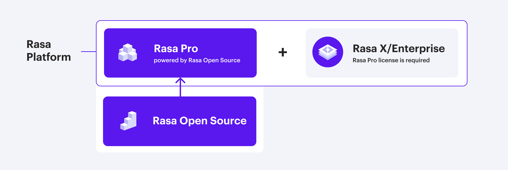

# 开源 Rasa 和 Rasa Pro 简介

!!! tip "注意"

    本文档仅翻译开源 Rasa 的部分内容，Rasa Pro 相关内容、代码参考、变更记录等内容不在翻译范畴内。

!!! tip "注意"

    本文档为作者在学习 Rasa 框架过程中沉淀而成，内容上多为直译，任何问题和建议欢迎在 [GitHub](https://github.com/leovan/rasa-doc) 上提出 issue 和 pull request。

开源 Rasa 的下载量超过 2500 万次，是用于构建聊天和基于语音的 AI 对话机器人的最流行的开源框架。

Rasa Pro 是一款有开源对话式 AI 框架提供支持的开放核心产品，其具有额外的分析、安全性和可观察性等功能。

Rasa Pro 是我们企业解决方案 Rasa Platform 的一部分。组成 Rasa Platform 的另一个产品是 Rasa X/Enterprise。这是一个低代码的用户界面，支持对话式 AI 团队大规模审查和改进 AI 对话机器人。其必须同 Rasa Pro 一起使用。要了解有关 Rasa X/Enterprise 的更多信息，请参阅 [Rasa X/Enterprise 文档](https://rasa.com/docs/rasa-enterprise/){:target="_blank"}。

你还可以在 [Rasa Product Release and Maintenance Policy](https://rasa.com/rasa-product-release-and-maintenance-policy/) 中了解发布和维护信息。

<figure markdown>
  
</figure>

## 开源 Rasa {#rasa-open-source}

开源 Rasa 是一个开源对话式 AI 平台，其可让你理解并维持对话，并通过一组 API 连接到消息传递频道和第三方系统。它提供了用于创建虚拟（数字）助手或对话机器人的模块。

## Rasa Pro {#rasa-pro}

!!! tip "Rasa Pro 许可"

    你需要一个许可证才能够使用 Rasa Pro。[请与 Rasa 专家联系](https://rasa.com/connect-with-rasa/)。

Rasa Pro 是一个由开源 Rasa 提供支持的对话式 AI 框架，其包括额外的功能、API 和服务，可满足企业在安全性、可观察性混合规模方面的特定需求。

当内容仅适用于 Rasa Pro 时，将出现如下标签：

<button data-md-color-primary="amber">仅 Rasa Pro</button>

这意味着你需要拥有 Rasa Pro 许可证才能使用该部分中描述的功能。
