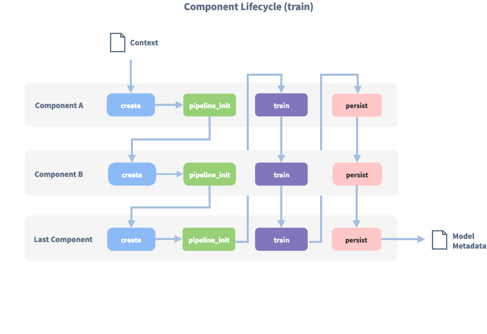

# NLU 模型调优

开源 Rasa 会在项目初始化时为你提供一个建议的 NLU 配置，但随着项目的增长，你可能需要调整配置来适应你的训练数据。

## 如何选择流水线 {#how-to-choose-a-pipeline}

在开源 Rasa 中，传入的消息由一系列组件处理。这些组件在 `config.yml` 文件中定义的 `pipeline` 中一个接一个地执行。选择一个 NLU 流水线可以让你自定义模型并在数据集上对其进行微调。

首先，你可以让[建议配置](model-configuration.md#suggested-config)功能为你选择一个默认流水线。只需要在 `config.yml` 文件中提供对话机器人的 `language`，并将 `pipeline` 留空。

```yaml
language: fr  # your 2-letter language code

pipeline:
# intentionally left empty
```

### 明智的启动流水线 {#sensible-starting-pipelines}

如果你从零开始，那么使用预训练的词向量会很有帮助。因为其已经编码了很多语言知识。例如，如果你的训练数据中有“I want to buy apples”这样的句子，并且要求 Rasa 预测“get pears”的意图，那么你的模型就已经知道“apples”和“pears”两个词是非常相似的。在没有足够的训练数据时这特别有用。

如果你开始使用 [spaCy 支持的一种语言](https://spacy.io/usage/models#languages)，建议你使用如下流水线：

```yaml
language: "fr"  # your two-letter language code

pipeline:
  - name: SpacyNLP
  - name: SpacyTokenizer
  - name: SpacyFeaturizer
  - name: RegexFeaturizer
  - name: LexicalSyntacticFeaturizer
  - name: CountVectorsFeaturizer
  - name: CountVectorsFeaturizer
    analyzer: "char_wb"
    min_ngram: 1
    max_ngram: 4
  - name: DIETClassifier
    epochs: 100
  - name: EntitySynonymMapper
  - name: ResponseSelector
    epochs: 100
```

这里使用了 [SpacyFeaturizer](components.md#spacyfeaturizer)，它提供了预训练的词向量（参见[语言模型](components.md#language-models)）。

如果你在流水线中不使用任何预训练的词向量，则不会被限定到特定语言，你可以训练你的模型用于更特定的领域。

如果你使用的语言没有词向量，或者你有非常特定领域的术语，建议使用如下流水线：

```yaml
language: "fr"  # your two-letter language code

pipeline:
  - name: WhitespaceTokenizer
  - name: RegexFeaturizer
  - name: LexicalSyntacticFeaturizer
  - name: CountVectorsFeaturizer
  - name: CountVectorsFeaturizer
    analyzer: "char_wb"
    min_ngram: 1
    max_ngram: 4
  - name: DIETClassifier
    epochs: 100
  - name: EntitySynonymMapper
  - name: ResponseSelector
    epochs: 100
```

这个流水线使用 [CountVectorsFeaturizer](components.md#countvectorsfeaturizer) 仅对你提供的训练数据进行训练。该流水线可以处理任何用空格分割单词的语言。如果你的语言不是这种情况，请查看 [WhitespaceTokenizer 的替代方案](components.md#tokenizers)。

!!! info "注意"

    如果你想在流水线中使用自定义组件，请参阅[自定义 NLU 组件](components.md)。

### 组件生命周期 {#component-lifecycle}

每个组件处理输入并/或产生输出。组件的顺序由它们在 `config.yml` 中列出的顺序决定。组件的输出可以被流水线中的任何其他组件使用。某些组件仅生成流水线中其他组件使用的信息。其他组件在处理过程完成后返回生成 `output` 属性。

例如，对于“I am looking for Chinese food”这句话，输出为：

```json
{
    "text": "I am looking for Chinese food",
    "entities": [
        {
            "start": 8,
            "end": 15,
            "value": "chinese",
            "entity": "cuisine",
            "extractor": "DIETClassifier",
            "confidence": 0.864
        }
    ],
    "intent": {"confidence": 0.6485910906220309, "name": "restaurant_search"},
    "intent_ranking": [
        {"confidence": 0.6485910906220309, "name": "restaurant_search"},
        {"confidence": 0.1416153159565678, "name": "affirm"}
    ]
}
```

这是作为如下流水线中不同组件的结果组合而成的：

```yaml
pipeline:
  - name: WhitespaceTokenizer
  - name: RegexFeaturizer
  - name: LexicalSyntacticFeaturizer
  - name: CountVectorsFeaturizer
  - name: CountVectorsFeaturizer
    analyzer: "char_wb"
    min_ngram: 1
    max_ngram: 4
  - name: DIETClassifier
  - name: EntitySynonymMapper
  - name: ResponseSelector
```

例如，这里的 `entities` 属性是由 `DIETClassifier` 组件创建的。

每个组件都可以实现 `Component` 基类的多个方法。在流水线中，这些不同的方法将按照特定顺序调用。例如我们在 `config.yml` 中添加如下流水线：

```yaml
pipeline:
  - name: "Component A"
  - name: "Component B"
  - name: "Last Component"
```

下图显示了此流水线训练期间的调用顺序：

<figure markdown>
  { width="600" }
  <figcaption>组件生命周期</figcaption>
</figure>

在使用 `create` 函数创建第一个组件之前，会创建一个所谓的 `context`（一个 python 字典）。此上下文用于在组件之间传递信息。例如，一个组件可以计算训练数据的特征向量，将其存储在上下文中，另一个组件可以从上下文中检索这些特征向量并进行意图分类。

最初上下文填充为所有配置的值。图中的箭头显示调用顺序并可视化了传递上下文的路径。在所有组件都被训练并持久化之后，最终上下文字典用于持久化模型的源数据。

### 多意图分类 {#doing-multi-intent-classification}

你可以使用多意图分类来预测多个意图（例如：`check_balances+transfer_money`），或对分层意图结构进行建模（例如：`feedback+positive` 相比于 `chitchat` 与 `feedback+negative` 更相似）。

要进行多意图分类，你需要在流水线中使用 [DIETClassifier](components.md#dietclassifier)。你还需要在使用的分词器中定义如下标志：

- `intent_tokenization_flag`：将其设置为 `True` 以便对意图标签进行标记。
- `intent_split_symbol`：将其设置为分割意图标签的分隔字符串。本例中为 `+`，默认为 `_`。

如下为示例配置：

```yaml
language: "en"

pipeline:
- name: "WhitespaceTokenizer"
  intent_tokenization_flag: True
  intent_split_symbol: "+"
- name: "CountVectorsFeaturizer"
- name: "DIETClassifier"
```

#### 何时使用多意图 {#when-to-use-multi-intents}

假如你有一个金融服务对话机器人，并且有 `check_balances` 和 `transfer_money` 意图：

```yaml
nlu:
- intent: check_balances
  examples: |
    - How much money do I have?
    - what's my account balance?

- intent: transfer_money
  examples: |
    - I want to transfer money to my savings account
    - transfer money
```

但是，你的机器人会收到类似如下的消息，它包含了两种意图：

<figure markdown>
  { width="600" }
  <figcaption>用户想知道余额以便转账</figcaption>
</figure>

如果有足够多的样本，你可以创建一个新的意图 `check_balances+transfer_money` 并为其添加样本，例如：

```yaml
nlu:
- intent: check_balances+transfer_money
  examples: |
    - How much money do I have? I want to transfer some to savings.
    - What's the balance on my account? I need to transfer some so I want to know how much I have
```

!!! info "注意"

    模型不会预测训练数据中未明确给出样本的任意意图组合。由于考虑到每个可能的意图组合都会导致意图数量的组合爆炸，因此你应该只添加那些来自真实用户的足够多样本的意图组合。

#### 如何使用多意图进行对话管理 {#when-to-use-multi-intents}

多意图分类旨在帮助在多意图之后进行动作预测的下游任务。在对话训练数据中使用多意图有两种互补的方式：

为多意图添加常规故事或规则。例如，给定每个单独意图如下两条规则：

```yaml
rules:
- rule: check account balance
  steps:
  - intent: check_balances
  - action: action_check_balances
- rule: transfer money
  steps:
  - intent: transfer_money
  - action: action_transfer_money
```

你可以为多意图添加另一条规则，指定一系列动作来解决这两个意图：

```yaml
rules:
- rule: check balances and transfer money
  steps:
  - intent: check_balances+transfer_money
  - action: action_check_balances
  - action: action_transfer_money
```

允许机器学习策略从单意图故事泛化至多意图场景。

使用多意图时，意图使用 multi-hot 编码的机器学习策略进行特征处理。这意味着 `check_balances+transfer_money` 的特征处理将覆盖单独意图的特征处理。机器学习策略（例如 [TEDPolicy](policies.md#ted-policy)）可以基于多意图做出预测，及时它没有明确出现在任何故事中。然而，它通常会表现得好像只有一个单独的意图存在，所以编写一个特定的故事或规则来处理多意图的情况总是一个不错的主意。

### 比较流水线 {#comparing-pipelines}

Rasa 提供了直接在数据上比较多个流水线性能的工具。更多信息请参见 [比较 NLU 流水线](testing-your-assistant.md#comparing-nlu-pipelines)。

## 选择正确的组件 {#choosing-the-right-components}

有用于实体提取、意图分类、响应选择、预处理等任务的组件。如果你想添加自己的组件，例如于执行拼写检查或进行情感分析，请参见[自定义 NLU 组件](components.md)。

流水线通常由三个主要部分组成：

### 分词 {#tokenization}

你可以使用 [WhitespaceTokenizer](components.md#whitespacetokenizer) 处理空格划分（即单词由空格分隔）的语言。如果你的语言未使用空格分割，则应该使用其他分词器。我们支持多种不同的[分词器](components.md)，或者你可以创建自己的[自定义分词器](components.md)。

!!! info "注意"

    流水线中的某些组件可能需要特定的分词器。你可以在各个组件的 `requires` 参数中找到这些要求。如果流水线中缺少必要的组件，则会引发错误。

### 特征提取 {#featurization}

你需要确定是否使用提供预训练词向量的组件。我们建议在仅有少量训练数据的情况下以预训练的词向量开始。一旦拥有了大量数据并确保相关词条都在数据中，则可以直接从训练数据中通过监督学习得到词向量。如果为你的语言找不到合适的预训练模型，则应该使用监督学习。

#### 预训练词向量 {#pre-trained-embeddings}

在流水线中使用预训练词向量的优势在于，如果你有一个训练样本，例如：“I want to buy apples”，并且要求 Rasa 预测为“get pears”意图，那么你的模型已经知道“apples”和“pears”这两个词非常相似了。如果你没有足够的训练数据，这将特别有用。我们支持一些提供预训练词向量的组件：

1. [MitieFeaturizer](components.md#mitiefeaturizer)
2. [SpacyFeaturizer](components.md#spacyfeaturizer)
3. [ConveRTFeaturizer](components.md#convertfeaturizer)
4. [LanguageModelFeaturizer](components.md#languagemodelfeaturizer)

如果你的训练数据是英文，我们建议使用 [ConveRTFeaturizer](components.md#convertfeaturizer)。[ConveRTFeaturizer](components.md#convertfeaturizer) 的优点是它不会独立处理用户信息的每个单词，而是为完整的句子创建上下文向量表示。例如：如果你有一个训练样本，例如：“Can I book a car?”，并且要求 Rasa 预测“I need a ride from my place”的意图，因为这两个示例的上下文向量表示非常相似，为两者分类的意图可能是相同的。如果你没有足够的训练数据，这也会很有用。

[ConveRTFeaturizer](components.md#convertfeaturizer) 的替代方案是 [LanguageModelFeaturizer](components.md#languagemodelfeaturizer)，它使用预训练的语言模型（例如 BERT，GPT-2 等）来提取完整句子的相似上下文表示。有关支持的语言模型的完整列表，请参见 [LanguageModelFeaturizer](components.md#languagemodelfeaturizer)。

如果你的训练数据不是英语，你还可以使用语言模型的不同变种，该语言模型已使用特定于你的训练数据的语言进行预训练。例如，BERT 模型有中文（`bert-base-chinese`）和日文（`bert-base-japanese`）变种。[Transformers 库的官方文档](https://huggingface.co/models?library=tf&sort=downloads)中提供了这些语言模型的不同变种的完整列表。

[spacynlp](components.md#spacyfeaturizer) 也提供了许多不同语言的词向量，因此你也可以将其作为一种选择，具体取决于你训练数据的语言。

#### 监督学习词向量 {#supervised-embeddings}

如果你在流水线中不使用任何预训练的词向量，则不会被限定到特定的语言，并且可以将你的模型训练至更特定的领域。例如，在一般英语中，“balance”一词同“symmetry”密切相关，但与“cash”一词却截然不同。但在银行领域中，“balance”和“cash”却紧密相关，你希望模型能够捕捉到这一点。如果你不相使用预训练的词向量，则应该使用[稀疏特征](components.md#featurizers)提取类别中的特征提取器，例如：[CountVectorsFeaturizer](components.md#countvectorsfeaturizer)，[RegexFeaturizer](components.md#regexfeaturizer) 和 [LexicalSyntacticFeaturizer](components.md#lexicalsyntacticfeaturizer)。

### 意图识别和响应选择 {#intent-classification--response-selectors}

根据数据你可能只想执行意图分类、实体识别和响应选择。或者你可能想要组合多个任务。我们为每个任务提供多个组件支持。我们建议使用 [DIETClassifier](components.md#dietclassifier) 进行意图分类和实体识别，[ResponseSelector](components.md#responseselector) 用于响应选择。

默认情况下，所有这些组件都会消费流水线中生成的所有特征。但是，有时限制特定组件使用的特征是有意义的。例如，[ResponseSelector](components.md#responseselector) 在没有使用 [RegexFeaturizer](components.md#regexfeaturizer) 或 [LexicalSyntacticFeaturizer](components.md#lexicalsyntacticfeaturizer) 提取的特征时会表现的更好。为此，你可以执行如下操作：通过 `alias` 选项为流水线中每个特征提取器设置一个别名。默认情况下，别名设置为特征提取器的完整类名，例如 `RegexFeaturizer`。你可以通过 `featurizers` 选项在 [ResponseSelector](components.md#responseselector) 上指定可以使用哪些特征提取器的哪些特征。如果你没有设置 `featurizers` 选项，则将使用所有特征。

如下是一个示例配置文件，其中 `DIETClassifier` 使用了全部可用特征，`ResponseSelector` 仅使用了来自 `ConveRTFeaturizer` 和 `CountVectorsFeaturizer` 的特征。

```yaml
language: "en"

pipeline:
  - name: ConveRTTokenizer
  - name: ConveRTFeaturizer
    alias: "convert"
  - name: RegexFeaturizer
    alias: "regex"
  - name: LexicalSyntacticFeaturizer
    alias: "lexical-syntactic"
  - name: CountVectorsFeaturizer
    alias: "cvf-word"
  - name: CountVectorsFeaturizer
    alias: "cvf-char"
    analyzer: "char_wb"
    min_ngram: 1
    max_ngram: 4
  - name: DIETClassifier
    epochs: 100
  - name: EntitySynonymMapper
  - name: ResponseSelector
    featurizers: ["convert", "cvf-word"]
    epochs: 100
```

### 实体提取 {#entity-extraction}

实体提取涉及解析用户信息来获取所需的信息。开源 Rasa 为自定义实体以及日期和位置等预训练实体提供实体提取器。如下是可用的提取器汇总以及它们最适用的场景：

| 组件                      | 依赖             | 模型                   | 备注               |
| :------------------------ | :--------------- | :--------------------- | :----------------- |
| `DIETClassifier`          | 无               | Transformer 条件随机场 | 适合训练自定义实体 |
| `CRFEntityExtractor`      | sklearn-crfsuite | 条件随机场             | 适合训练自定义实体 |
| `SpacyEntityExtractor`    | spaCy            | 平均感知器             | 提供预训练实体     |
| `DucklingEntityExtractor` | 运行 duckling    | 上下文无关语法         | 提供预训练实体     |
| `MitieEntityExtractor`    | MITIE            | 结构化支持向量机       | 适合训练自定义实体 |
| `EntitySynonymMapper`     | 存在的实体       | 无                     | 映射已知同义词     |

## 提升性能 {#improving-performance}

### 处理类型不均衡 {#handling-class-imbalance}

如果存在较大的类型不均衡，分类算法通常表现不佳。例如，如果你有很多针对某些意图的训练数据，但针对其他意图的训练数据很少。为了缓解这个问题，你可以使用均衡的批处理策略。该算法确保所有类型在每个批次中都出现，或者至少能在尽可能多的批次中，但仍会出现一些类型比其他类型更频繁的事实。默认情况下会使用均衡批处理。为了关闭它并使用经典的批处理策略，可以在配置文件中包含 `batch_strategy: sequence`。

```yaml
language: "en"

pipeline:
# - ... other components
- name: "DIETClassifier"
  batch_strategy: sequence
```

### 访问诊断数据 {#accessing-diagnostic-data}

为了更好的了解模型的作用，你可以访问预测过程的中间结果。为此，你需要访问 [Message](https://rasa.com/docs/rasa/reference/rasa/shared/nlu/training_data/message#message-objects){:target="_blank"} 和 [Prediction](https://rasa.com/docs/rasa/reference/rasa/core/policies/policy#policyprediction-objects){:target="_blank"} 对象的 `diagnostic_data` 字段。其中包含有关注意力权重和推理计算的其他中间结果信息。你可以使用此信息进行调试和微调，例如使用 [RasaLit](https://github.com/RasaHQ/rasalit)。

[训练完模型](command-line-interface.md#rasa-train)后，你可以访问 DIET 的诊断数据，给定一条已处理的消息，如下所示：

```python
nlu_diagnostic_data = message.as_dict()[DIAGNOSTIC_DATA]

for component_name, diagnostic_data in nlu_diagnostic_data.items():
    attention_weights = diagnostic_data["attention_weights"]
    print(f"attention_weights for {component_name}:")
    print(attention_weights)

    text_transformed = diagnostic_data["text_transformed"]
    print(f"\ntext_transformed for {component_name}:")
    print(text_transformed)
```

你可以像这样访问 TED 的诊断数据：

```python
prediction = policy.predict_action_probabilities(
    GREET_RULE, domain, RegexInterpreter()
)
print(f"{prediction.diagnostic_data.get('attention_weights')}")
```

## 配置 TensorFlow {#configuring-tensorflow}

TensorFlow 允许通过 [TF Config 子模块](https://www.tensorflow.org/api_docs/python/tf/config)在运行时环境中配置选项。开源 Rasa 支持这些配置选项的一小部分，并对 `tf.config` 子模块进行适当的调用。这个较小的子集包括开发人员经常在开源 Rasa 中一起使用的配置。所有配置选项都使用环境变量指定，如后续部分所示。

### 确定性操作 {#deterministic-operations}

如果你使用 GPU 并且在流水线中有一个或多个稀疏特征提取器，且/或使用任意 `TEDPolicy`、`UnexpecTEDIntentPolicy`、`DIETClassifier` 或 `ResponseSelector`，如果你设置环境变量 `TF_DETERMINISTIC_OPS=1`，训练和测试将失败。是因为底层 tensorflow 操作 `tf.sparse.sparse_dense_matmul`、`tf.nn.sparse_softmax_cross_entropy_with_logits` 和 `tf.math.unsorted_segment` 没有确定性的 GPU 实现。有关更多信息，请参见[此处](https://github.com/tensorflow/community/blob/master/rfcs/20210119-determinism.md)。

基于上述原因，模型也不保证在 GPU 上执行多次运行训练时产生完全相同的性能。这也适用余在相同的训练数据上多次运行训练的情况，使用相同的配置和适当设置随机数种子，同时在标准的保留测试集上进行评估。内部实验表明，在对各种数据集的保留测试集进行训练和评估时，模型性能会出现如下波动（实验在每个数据集上运行 5 次）

```
+-----------------------+------------+------------------+------------------+-------------------+
| Task,                 | Number of  | Average standard | Minimum standard | Maximum standard  |
| Metric (Range)        | datasets   | deviation        | deviation        | deviation         |
+-----------------------+------------+------------------+------------------+-------------------+
| Intent Classification | 11         | 0.0042           | 2.4e-5           | 0.0176            |
| Macro F1 (0-1)        |            |                  |                  |                   |
+-----------------------+------------+------------------+------------------+-------------------+
| Entity Recognition    | 7          | 0.0019           | 0.0007           | 0.0044            |
| Macro F1 (0-1)        |            |                  |                  |                   |
+-----------------------+------------+------------------+------------------+-------------------+
| Response Selection    | 2          | 0.0098           | 0.0003           | 0.0231            |
| Macro F1 (0-1)        |            |                  |                  |                   |
+-----------------------+------------+------------------+------------------+-------------------+
| Action Selection      | 5          | 0.0025           | 0.0010           | 0.0053            |
| Macro F1 (0-1)        |            |                  |                  |                   |
+-----------------------+------------+------------------+------------------+-------------------+
| Conversation Success  | 5          | 0.0077           | 0.0052           | 0.0103            |
| Accuracy (0-1)        |            |                  |                  |                   |
+-----------------------+------------+------------------+------------------+-------------------+
```

上述实验运行在 Nvidia Tesla P4 GPU 上。当你对数据集进行评估时，可以预期模型性能会出现类似的波动。在测试不同流水线配置中，当你在流水线中使用稀疏的特征提取器时，波动会更加明显。通过检查特征提取器的 `Type`，你可以[在此](components.md#featurizers)查看哪些特征提取器是稀疏的。

当在 CPU 上训练时，当如下这些没有发生改变时，上述任务的模型性能应该可以在多次运行中复现：

- 训练数据
- 测试数据
- 配置流水线
- 配置组件中的随机数种子

### 优化 CPU 性能 {#optimizing-cpu-performance}

!!! info "注意"

    我们建议仅在你是高级 TensorFlow 用户并了解流水线中机器学习组件的实现时再配置这些选项。这些选项会影响在 TensorFlow 中如何进行操作。将他们保留为默认值是不错的选择。

取决于 NLU 组件或核心策略使用的 TensorFlow 操作，你可以通过调整这些选项来利用多核 CPU 并行能力。

#### 并行化单个操作 {#parallelizing-one-operation}

设置 `TF_INTRA_OP_PARALLELISM_THREADS` 环境变量来指定可用于执行单个操作的最大线程数。例如，像 `tf.matmul()` 和 `tf.reduce_sum` 这样的操作可以在多个线程上并行执行。此变量的默认值为 `0`，这意味着 TensorFlow 将为每个 CPU 内核分配一个线程。

#### 并行化多个操作 {#parallelizing-multiple-operations}

设置 `TF_INTER_OP_PARALLELISM_THREADS` 环境变量来指定可用于执行多个非阻塞操作的最大线程数。这些包括在 TensorFlow 图中没有有向路径的操作。换句话说，即一个操作的计算不会影响另一个操作的计算。此变量的默认值为 `0`，这意味着 TensorFlow 将为每个 CPU 内核分配一个线程。

要了解有关这两个选项之间有何不同，请参见这个 [stackoverflow 回答](https://stackoverflow.com/questions/41233635/meaning-of-inter-op-parallelism-threads-and-intra-op-parallelism-threads/41233901#41233901)。

### 优化 GPU 性能 {#optimizing-gpu-performance}

#### 限制 GPU 内存增长 {#limiting-gpu-memory-growth}

默认情况下，TensorFlow 会为正在运行的进程阻塞所有可用的 GPU 内存。如果你正在运行多个 TensorFlow 进程并希望在它们之间分配内存，可能会受到限制。为了防止开源 Rasa 阻塞所有可用的 GPU 内存，请将 `TF_FORCE_GPU_ALLOW_GROWTH` 设置为 `True`。

#### 限制可能用的绝对 GPU 内存 {#restricting-absolute-gpu-memory-available}

你可能希望限制开源 Rasa 进程可以使用的 GPU 内存的绝对数量。

例如，假设你有两个可见 GPU（`GPU:0` 和 `GPU:1`），并且你想从第一个 GPU 分配 1024 MB，从第二个 GPU 分配 2048 MB。你可以通过设置 `TF_GPU_MEMORY_ALLOC` 变量为 `0:1024, 1:2048` 来实现。
